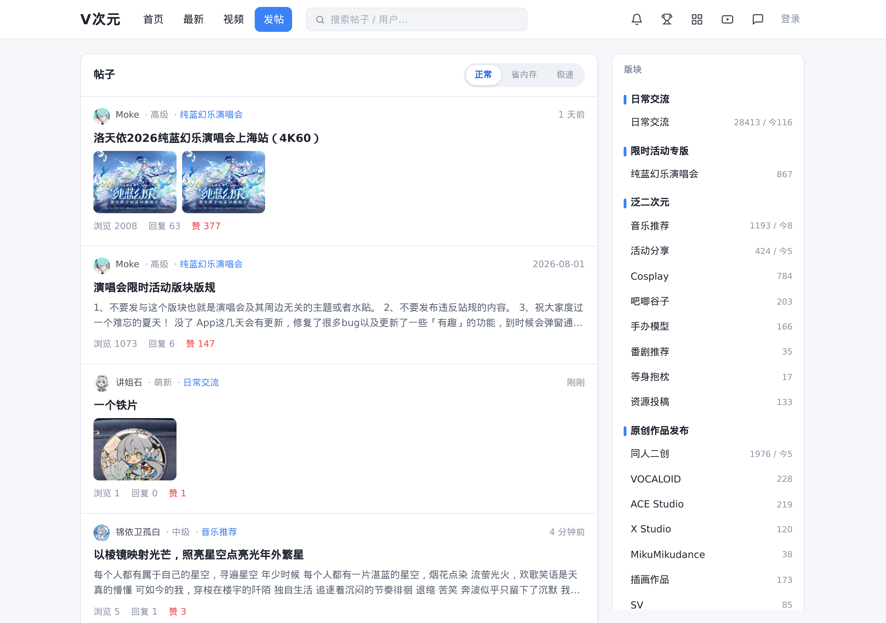
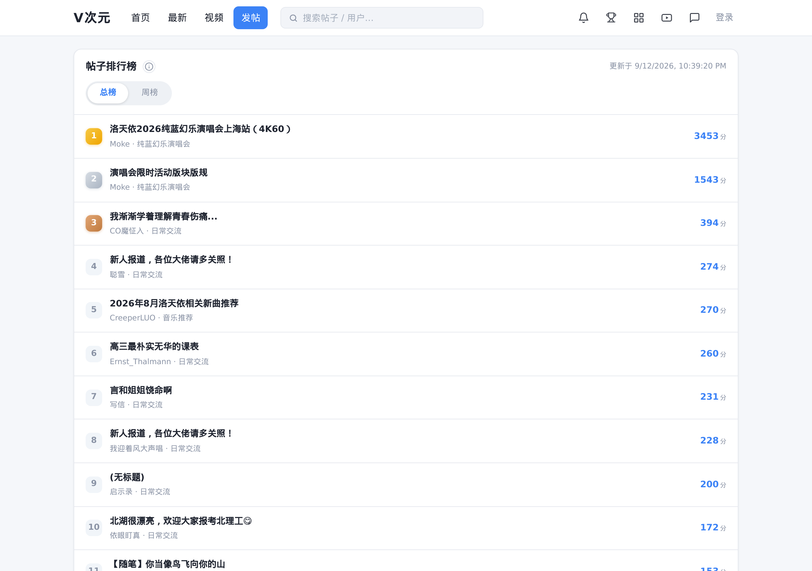
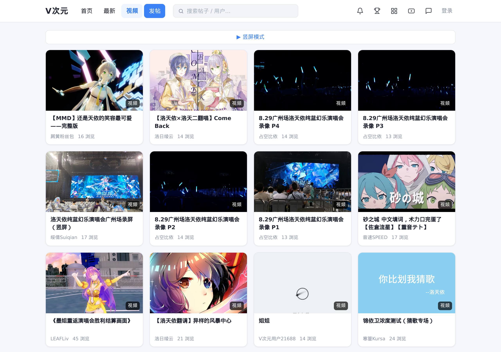
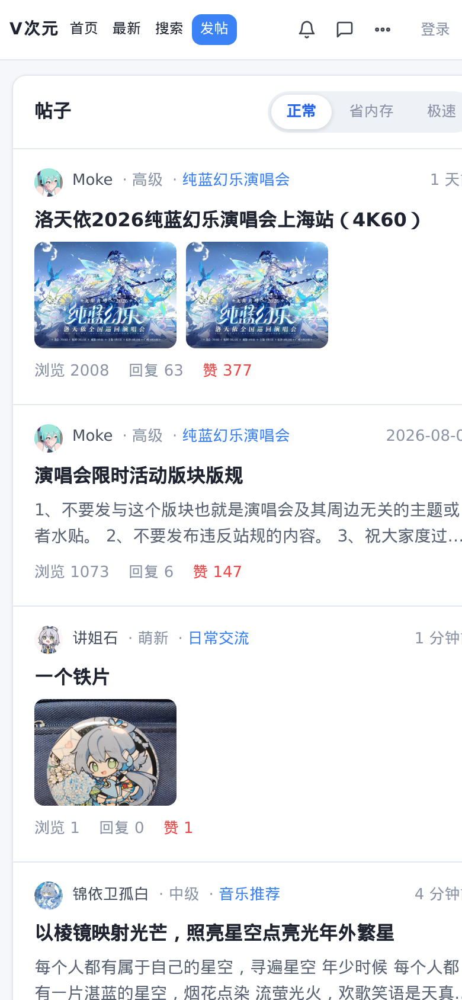

# V次元代理站 (vcy-proxy-public)

[V次元](https://bbs.lty.fan) VOCALOID 社区论坛的网页代理站(轻量、快速、手机友好)。

> 这是**公开版**:完整的 Web 应用代码(前端 + 后端框架),涉及逆向破解的算法(EdgeOne 人机验证求解、历史 POW 验证码破解、源站签名密钥、源站登录滑块求解)已从本仓库移除,相关部分替换为环境变量配置或占位实现,保留完整业务逻辑与代码结构供学习参考。

## 截图

桌面端:

| 首页 | 排行榜 |
|---|---|
|  |  |

| 视频中心 | 手机端 |
|---|---|
|  |  |

## 功能

- 帖子浏览: 首页 / 最新 / 版块 / 搜索(关键词高亮)
- 帖子详情: 图片查看、表情、附件查看与下载、视频内嵌播放、评论区点赞/回复
- 视频中心: 瀑布流浏览、视频播放(30s 试看自动切完整版)、封面懒加载
- 用户系统: 邀请码注册 / 登录、个人主页、签名档、粉丝/关注
- 每日自动签到: 签到日历与补签
- 帖子排行榜: 总榜 / 周榜,综合浏览 / 点赞 / 评论
- 站内信: 私信收发、撤回、未读提示
- 通知: 点赞/回复/关注提醒,红点轮询,全部已读
- 表情包系统: 发帖 / 评论 / 私信 / 回复通用
- 三模式: 极速(暴力预加载)/ 正常(默认)/ 省内存(限制图片)
- 手机端适配: 顶栏精简 + 「更多」菜单
- 站内问卷: 匿名提交,SMTP 邮件通知站长
- 反馈: bug 建议直达站长

## 技术栈

- 后端: Flask + curl_cffi(浏览器指纹模拟)
- 前端: 原生 JS 单页应用(无框架),IntersectionObserver 无限滚动,localStorage 多用户 token
- 视频: hls.js 播放

## 目录结构

```
├── server.py            # Flask 后端代理 (反向代理源站 /webapi/*)
├── static/              # 前端 (index.html / app.js / style.css / hls.min.js / leaflet.*)
├── docs/screenshots/    # 截图
└── .gitignore
```

## 部署

```bash
pip install flask curl_cffi pycryptodome
python server.py    # 监听 0.0.0.0:8000
```

> 部署前请先阅读 [`docs/LIMITATIONS.md`](docs/LIMITATIONS.md)(环境、配置前提与注意事项)。

### 环境变量(逆向部分已移除,需自行对接)

| 变量 | 说明 |
|---|---|
| `VCY_API_BASE` | 源站 API 地址,默认 `https://bbs.lty.fan` |
| `VCY_SIGN_SECRET` | 源站接口签名密钥(MD5(secret+path+ts)) |
| `VCY_K1` / `VCY_K2` | 签名参数名 |
| `VCY_SOCKS` | 出站代理(如 `socks5h://127.0.0.1:1080`),留空直连 |
| `VCY_LOGIN_USER` / `VCY_LOGIN_PASS` | 全局保活账号 |

`config.json`(不入库): `access_token` / `refresh_token` / `smtp`(邮件通知)。

## 架构说明

```
浏览器 → 本站 (Flask) → curl_cffi 模拟浏览器 → 源站 bbs.lty.fan /webapi/*
                 └─ 签名、token 管理、验证码处理(公开版为占位)
```

- 后端 `_api_raw()` 统一转发请求,自动附带签名与鉴权头;出站可经 `VCY_SOCKS` 代理(失败自动回退直连)
- 视频流: 源站签发 psign JWT → 腾讯云 getplayinfo → m3u8 直链(未登录 30s 试看,登录用户自动刷新 token 解锁完整版)
- 附件经 `/api/attach` 同域代理下载,避免 OSS 防盗链
- 前端静态资源带 `?v=` 版本号,更新后需递增

## 许可证

仅供学习参考,请勿用于商业用途。
